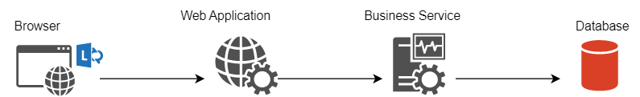

# Performance hệ thống

## Mục lục
- [x] Performance có nghĩa là gì?
- [x] Nguyên tắc tối ưu
- [x] Mục tiêu tối ưu
- [x] Phương pháp đo lường hiệu suất
- [x] Độ trễ của mạng
- [x] Cách tối ưu độ trễ mạng
- [x] Độ trễ của bộ nhớ

## Performance có nghĩa là gì?

> Hiệu suất là tốc độ đáp ứng một request. Ví dụ trong một ứng dụng Web (dạng client-server), khi có một request đến server thì server sẽ phản hổi lại một response nhanh như thế nào (ví dụ 1ms, 10ms,.. cho một request) được xem là hiệu suất của hệ thống.

   
   
  <spans>Hình ảnh một hệ thống đơn giản</spans>

### Nguyên nhân phát sinh vấn đề hiệu suất
- Thắt nút cổ chai tại các hàng đợi xử lý (queue network, queue trong OS, queue IO trong database,...)
  + Database
    * Do viết query chưa hiệu quả
    * Tạo schema database chưa tốt
  + Tầng ứng dụng
    * Thuật toán xử lý chậm chạm
    * Sử dụng cấu trúc dữ liệu không hiệu quả
- Chưa áp dụng xử lý đa luồng
- Bị giới hạn về phần cứng (ví dụ như sử dụng Disk HDD để đọc ghi file thay vì SSD)

### Vậy nguyên tắc nâng cấp hệ thống:
- Tăng tính hiệu quả tại các điểm sau:
  + Sử dụng resource sao cho hiệu quả (ví dụ như quản lý tốt việc sử dụng memory, sử dụng HTTP2 thay vì dùng HTTP1.1,...)
  + Viết logic (thuật toán), query tại tầng ứng dụng và database sao cho hiệu quả.
  + Sử dụng cấu trúc dữ liệu và schema hợp lý. Ví dụ nếu thiết kế business tốt thay vì tạo 10 table thì chỉ cần tạo 5 table và như thế câu query cũng đơn giản và nhanh hơn.
  + Sử dụng cache nếu có thể. Ví dụ cache tại phía client, server, database.
- Xử lý đa luồng thay vì xử lý tuần tự.
- Tăng khả năng của phần cứng. Nhiều lúc hệ thống ổn hết rồi mà do phần cứng cùi mía quá làm giảm performance.

> Vậy mục tiêu tối ưu của chúng ta là `làm sao để tăng tốc độ đáp ứng của một request` tức là chúng ta đang làm giảm độ trễ. Và làm sao để `tăng throughput` của hệ thống tức là tăng khả năng xử lý request của hệ thống ví dụ system có thể xử lý 1000 request/1s bây giờ chúng ta tuning thành 10000/1s.

## Phương pháp đo lường hiệu suất

- Các tiêu chí cần đo để đánh giá:
  + Độ trễ
  + Thông lượng
  + Error
  + Tài nguyên( CPU, dung lượng Memory sử dụng,...)
  
## Độ trễ mạng

Cách tối ưu độ trễ của mạng (chúng ta đang xét mô hình client-server):
- Sử dụng kết nối persistent.
- Giảm dung lượng data truyền qua mạng

### Sử dụng kết nối persistent

   
   
  Hình ảnh tham khảo trên internet

> Trong hình minh họa trên, chúng ta thấy với kết nốt non-persistent sẽ tốn thời gian nhiều hơn do phải thiết lập lại connection. Vậy chúng ta nên chọn persistent connection đối với các giao thức mạng.

Chúng ta xem xét hệ thống của chúng ta đang sử dụng giao thức mạng nào?
- Http1.0 sử dụng non-persistent connection;
- Http1.1, Http2.0 và [Http/3](https://datatracker.ietf.org/doc/html/rfc9114)  sử dụng persistent connection;

> Nên ưu tiên chon Http2.0 hoặc Http/3 vì nó cho tốc độ tải nhanh hơn Http1.0 và Http1.1

- Nếu là server giao tiếp với server, chúng ta nên sử dụng Http2.0 (thường dùng gRPC) hay sử dụng Message broken (ví dụ RabbitMQ sử dụng giao thức AMQP ) .

### Giảm dung lượng data truyền qua mạng

- Chúng ta sử dụng kỹ thuật caching phía trình duyệt để cache lại các file script, json,... nhằm tăng tốc cho những lần truy cập sau;
- Chúng ta cần `Bundling` và `Minification` các file script trước khi gửi về client;
- Nén dữ liệu trước khi gửi qua mạng.

## Giảm độ trễ của việc truy cập memory

Chúng ta cần làm những việc sau:

- Tránh làm phình bộ nhớ
  + Giữ cho phần code base càng nhỏ càng tốt. Vì khi chạy chương trình phần code base cũng được nạp vào memory. Tuy nhiên ứng dụng của chúng ta phụ thuộc vào framework vậy nên chúng ta khó control độ lớn của code base. Nhưng ở đây mình có một số gợi ý là hãy làm tốt khâu thiết kế kiến trúc và code theo design pattern (nếu đang sử dụng hướng đối tượng).
  + Chúng ta tránh khai báo đối tượng khi không cần thiết để tránh phình Head Memory.
  + Sử dụng tốt pattern dispose, để hủy resource khi không sử dụng.
  + Tránh sử dụng các thư viện ngốn nhiều memory ví dụ khi xử lý excel thì `close xml` ngốn nhiều memory hơn là `aspose`.
- Sử dụng Weak Reference cho các đối tượng lớn
- Chia nhỏ một process lớn thành nhiều process nhỏ.
- Đối với database thì cần chuẩn hóa (normalize) để câu query được tối ưu hơn, vì ít join hơn nên bộ nhớ sử dụng dưới database cũng ít hơn.

